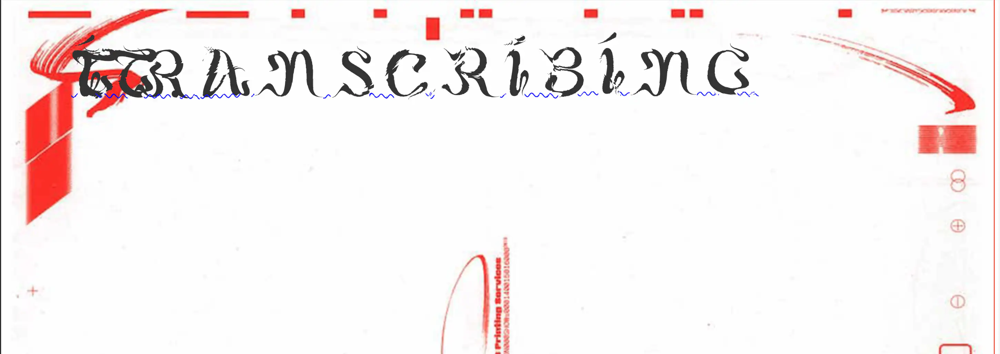
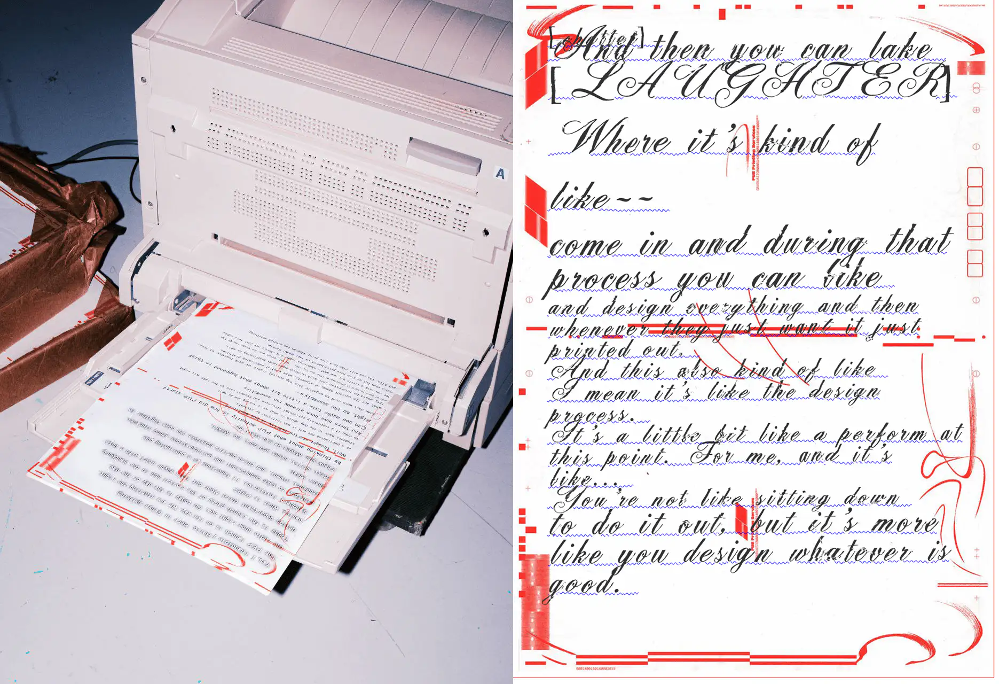
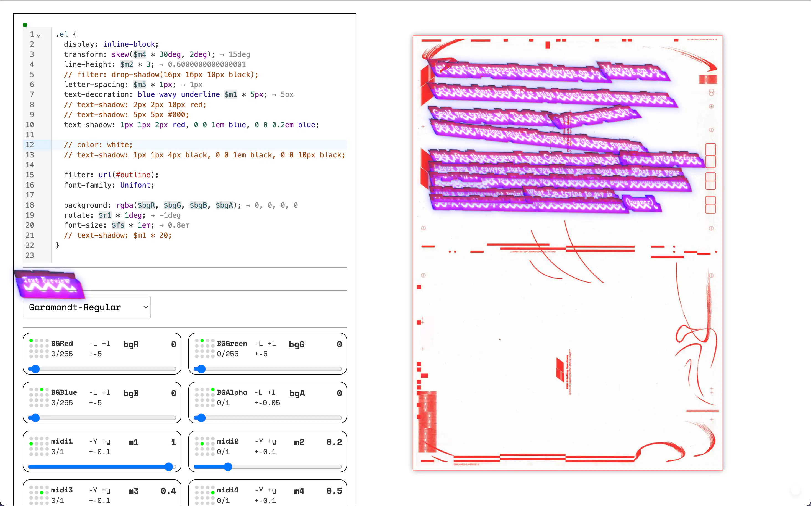
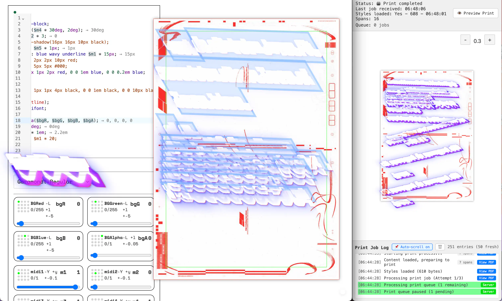
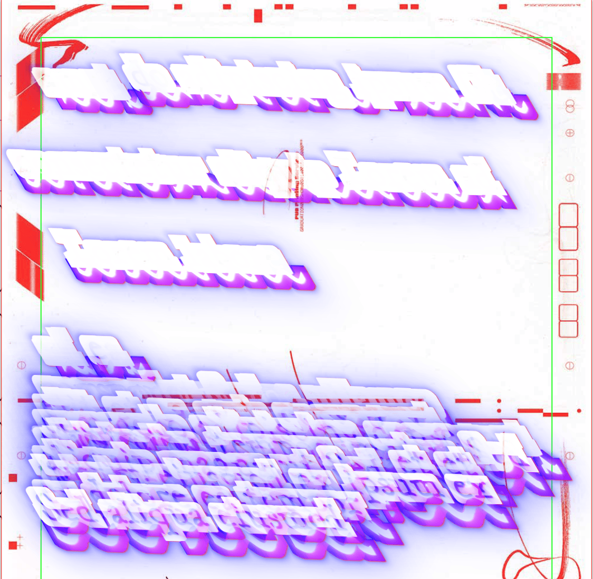

# My book is done when I'mm done speaking

> **A (radio)-live-trans{crip}tion—live-coding-VJ-PDF-printing-tool-?**

Originally to document a [pub Sandberg](https://pub.sandberg.nl) radio show in real-time… to produce a publication during the event itself…
Now a tool to taste the material of spoken language through real-time transcription, typographic intervention (quick-quick you only have 2 seconds to design you type)… *performing design* is full of mistakes.



> **The flow:**
>
> 1. streams audio from the microphone
> 2. transcribes the audio using whisper
> 3. places the transcription on a3 page
> 4. every incoming transcription can be individually styled with CSS
> 5. additionally with custom SVG-filters
> 6. custom variables with a midi bridge for live manipulation
> 7. full page gets automatically printed and saved to PDF

## Context

Using machine transcription, and typographic expression as performative act (public and real-time — no way to edit). Embracing all the mistakes of live-performance… neither whisper is able to capture the full bandwidth of reality — neither you and your speed in writing css-parameters on the fly.





The system operates as both a performance tool and a critical examination of:

- The translation between spoken and written language
- Real-time typography as performative practice
- The politics of automated transcription
- Material documentation of ephemeral moments

## Implementation

Built with Electron + Svelte, the system combines:

- Real-time audio transcription (Whisper)
- Dynamic typographic manipulation
- Physical output through continuous printing
- MIDI-based parameter space exploration



### Interface

Real-time Manipulation:
- Direct CSS parameter modification
- SVG filter composition
- Typography variation
- Live visual feedback

Physical Output:
- Continuous A3 documentation
- Automated layout composition
- Print queue orchestration
- PDF archival



### MIDI Control

Parameter space exploration through:
- Spatial relationships
- Color systems
- Scale variations
- Visual effects
- Temporal dynamics

### Configuration Example

```javascript
{
  "name": "midi2",
  "var": "m2",
  "value": 1,
  "default": 1,
  "step": 0.1,
  "knobNR": 5,
  "range": [0, 1],
  "keys": {
    "up": "y",
    "down": "Y"
  }
}
```

### Interface Shortcuts

- `ctrl + /` : Comment toggle
- `shift + alt + a` : Block comment
- `Ctrl-Space` : Completion
- `CTRL-Enter` : Line execution
- `CTRL-Shift-Enter` : Full execution
- `ALT-Enter` : Block execution

Code completion for:
- MIDI variables (`$`)
- SVG filters (`filter: url(#`)
- Typography (`font-family:`)

### Transcription

Custom implementation of Whisper.cpp (Gerganov's version of OpenAI's Whisper) optimized for Apple Metal, providing continuous audio interpretation at 500ms intervals. At the time this version was the most reliable version to support something as messy as a radio program with multiple voices and music playing.

### TODO run in the browser via WASM

The current version relies on a custom implementation of: <https://github.com/milangress/whisper.cpp-milan/blob/master/examples/stream/stream.cpp> that is only compiled for M1 Macs.
This version <https://whisper.ggerganov.com/stream/> could be supported without compiling it as command line tool.

## License

MIT License - See LICENSE for details
