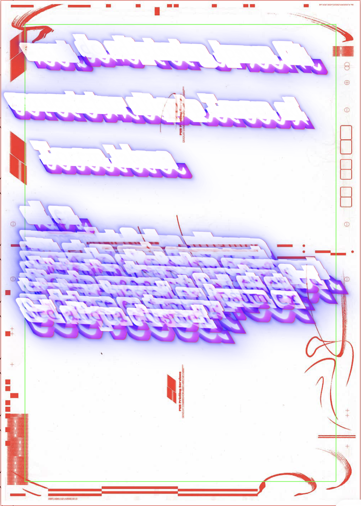

# The book is done when I'm done speaking

> **A (radio)-live-trans{crip}tion—live-coding-VJ-PDF-printing-tool**

Originally developed to document a [pub Sandberg](https://pub.sandberg.nl) radio show in real-time, producing a publication during the event itself.
Now a tool to experience the material of spoken language through real-time transcription and typographic intervention (quick-quick, you only have 2 seconds to design your text)... _performing design_ is full of mistakes.


> **The flow:**
>
> 1. Streams audio from the microphone
> 2. Transcribes the audio using [whisper.cpp](https://github.com/ggml-org/whisper.cpp)
> 3. Each incoming transcription can be individually styled with CSS
> 4. Additionally enhanced with custom SVG-filters
> 5. Custom variables with a MIDI bridge for live manipulation
> 6. Full page gets automatically printed and saved to PDF

## Context

This project uses machine transcription and typographic expression as a performative act (public and real-time — with no way to edit). It embraces all the mistakes of live performance. Neither Whisper is able to capture the full bandwidth of reality, nor are you with your speed in writing CSS parameters on the fly.


## Implementation

Built with Electron + Svelte 5


## The Livecoding Editor

A block is a continuous section of properties inside a CSS selector without any empty lines in between.

### "Executing CSS"
The editor simulates executing CSS by toggling line comments on and off:

- `Alt-Enter`: Line execution & comment line if uncommented
- `Ctrl-Enter`: Block execution
- `Shift-Alt-Enter`: Toggle comment block

### Stack Mode

Stack mode allows you to add properties from anywhere (any open editor window) to the currently applied CSS code. The stack can have a maximum of 15 lines.

> Mod will be Cmd on Mac and Ctrl on Windows/Linux

- `Mod-Enter`: Push block onto stack
- `Shift-Mod-Enter`: Push line onto stack
- `Alt-Mod-Enter`: Clear stack

### Block Navigation

- `Shift-ArrowUp`: Go block up
- `Shift-ArrowDown`: Go block down

### MIDI Values

Through the config, you can define MIDI inputs:

```javascript
{
  "name": "midi2",   // Name or description
  "var": "m2",       // Variable in CSS -> $m2
  "value": 1,        // Current value
  "default": 1,      // Value to reset to
  "step": 0.1,       // Step size for slider elements
  "knobNum": 5,      // The physical MIDI input (in channel zero) 
  "range": [0, 1],   // Maps the incoming value changes to this range
}
```

In the code editor, these $m2 variables will create draggable values:
- Hold `ALT` while dragging a value to not clamp to range


### Additional Shortkeys:

- `Ctrl + /`: Comment toggle
- `Shift + Alt + A`: Block comment
- `Ctrl-Space`: Completion
- `Alt-A`: Trigger AI edit

### Code Completion:

- MIDI variables (`$`)
- SVG filters (`filter: url(#`)
- Typography (`font-family:`)


## CSS Structure

```css
/* The current element */
.el {
  display: inline-block;
  transform: skew(30deg, 2deg);
  line-height: $m2 * 2;
  filter: url(#blobs)
} 
/* The whole page */
#page {
  // filter: contrast(150) brightness(3) url(#emboss) invert();
}
/* The page number */
#num {
  scale: 5;
}
```

### Interface

Real-time Manipulation:

- Direct CSS parameter modification
- SVG filter composition
- Typography variation
- Live visual feedback

Physical Output:

- Continuous A3 documentation
- Automated layout composition
- Print queue orchestration
- PDF archival



### Transcription

Custom implementation of Whisper.cpp (Gerganov's version of OpenAI's Whisper) optimized for Apple Metal, providing continuous audio interpretation at 500ms intervals. At the time of development, this version was the most reliable option to support something as complex as a radio program with multiple voices and music playing simultaneously.

### TODO: Run in the browser via WASM

The current version relies on a custom implementation from: <https://github.com/milangress/whisper.cpp-milan/blob/master/examples/stream/stream.cpp> that is only compiled for M1 Macs.
This version <https://whisper.ggerganov.com/stream/> could be supported without compiling it as a command line tool.

## License

MIT License - See LICENSE for details
